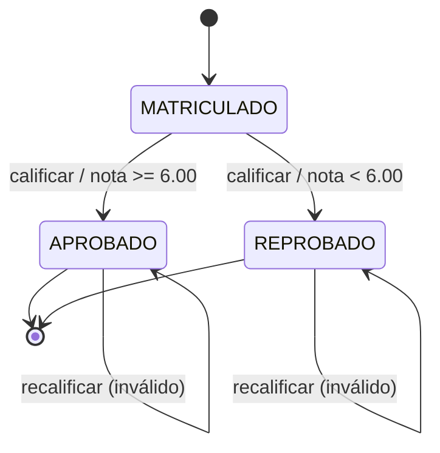

# Informe de Casos de Prueba - Sistema de Gestión Universitaria

**Nombre:** Melany Lema  

**Fecha:** 17/06/2026

**Asignatura:** Validación y Verificación de Software

## 1. Alcance

Este informe documenta los casos de prueba de caja negra solicitados para el Sistema de Gestión Universitaria, cubriendo:

- Partición de equivalencia y análisis de límites para Estudiante y Materia.
- Tabla de decisión para la operación de matricular.
- Transición de estados para matrícula y calificación.
- Casos de uso: matricular estudiante y registrar nota.
- Resumen de ejecución sobre los datos semilla provistos por el sistema.
- Implementación de pruebas automatizadas de integración en el backend.

## 2. Partición de Equivalencia y Análisis de Límites

### 2.1 Módulo de Estudiantes

#### Clases de equivalencia por campo

| Campo | Clase válida | Clases inválidas |
|---|---|---|
| nombre | Solo letras y espacios, longitud entre 2 y 50 | Vacío, menos de 2 caracteres, más de 50 caracteres, números, símbolos |
| apellido | Solo letras y espacios, longitud entre 2 y 50 | Vacío, menos de 2 caracteres, más de 50 caracteres, números, símbolos |
| email | Formato válido de correo, único en el sistema | Vacío, formato inválido, duplicado |
| fechaNacimiento | Fecha YYYY-MM-DD en el pasado, edad >= 17 | Vacío, formato inválido, fecha futura, edad menor a 17 |
| estado | ACTIVO, INACTIVO, GRADUADO, SUSPENDIDO (solo edición) | Valores distintos a los permitidos |

#### Valores límite

| Campo | Límite inferior | Casos cercanos | Límite superior | Casos cercanos |
|---|---|---|---|---|
| nombre | 2 caracteres | 1, 2, 3 | 50 caracteres | 49, 50, 51 |
| apellido | 2 caracteres | 1, 2, 3 | 50 caracteres | 49, 50, 51 |
| fechaNacimiento | edad mínima 17 años | 16 años, 17 años, 18 años | N/A | N/A |
| email | longitud no restringida explícitamente por negocio | formato válido/inválido | N/A | N/A |

#### Casos de prueba por campo

| ID | Campo | Dato de entrada | Clase de equivalencia | Resultado esperado |
|---|---|---|---|---|
| EST-PE-01 | nombre | Juan | Válida | Aceptado |
| EST-PE-02 | nombre | A | Inválida por longitud mínima | Error 400: nombre debe tener entre 2 y 50 caracteres |
| EST-PE-03 | nombre | Juan3 | Inválida por caracteres | Error 400: solo letras y espacios |
| EST-PE-04 | apellido | Perez | Válida | Aceptado |
| EST-PE-05 | apellido | P | Inválida por longitud mínima | Error 400 |
| EST-PE-06 | apellido | Perez$ | Inválida por caracteres | Error 400 |
| EST-PE-07 | email | estudiante1@email.com | Válida | Aceptado |
| EST-PE-08 | email | correo-invalido | Inválida por formato | Error 400: formato válido |
| EST-PE-09 | email | juan.perez@email.com | Inválida por duplicado (según seed) | Error 422: email ya registrado |
| EST-PE-10 | fechaNacimiento | 2000-05-15 | Válida | Aceptado |
| EST-PE-11 | fechaNacimiento | 2025-01-01 | Inválida por fecha futura | Error 422: fecha en el pasado |
| EST-PE-12 | fechaNacimiento | 2010-01-01 | Inválida por edad menor a 17 | Error 422: debe tener al menos 17 años |
| EST-PE-13 | estado | ACTIVO | Válida para edición | Aceptado |
| EST-PE-14 | estado | EXPULSADO | Inválida | Error 422: estado inválido |
| EST-PE-15 | estado | [vacío] | No enviado en creación | Estado por defecto ACTIVO |

#### Observaciones funcionales

- Al crear un estudiante, el estado por defecto es ACTIVO.
- El email se normaliza a minúsculas y se recorta en el service.
- La edad mínima real validada por el backend es 17 años calculados con la fecha actual.

### 2.2 Módulo de Materias

#### Clases de equivalencia por campo

| Campo | Clase válida | Clases inválidas |
|---|---|---|
| codigo | Formato MAT-XXX, con exactamente 3 dígitos y único | Vacío, formato incorrecto, menos/más de 3 dígitos, duplicado |
| nombre | Longitud entre 3 y 100 caracteres | Vacío, menos de 3, más de 100 |
| creditos | Entero entre 1 y 6 inclusive | Menor que 1, mayor que 6, nulo |
| cupoMaximo | Entero entre 5 y 50 inclusive | Menor que 5, mayor que 50, nulo |

#### Valores límite

| Campo | Límite inferior | Casos cercanos | Límite superior | Casos cercanos |
|---|---|---|---|---|
| codigo | MAT-000 | MAT-000, MAT-001 | MAT-999 | MAT-998, MAT-999 |
| nombre | 3 caracteres | 2, 3, 4 | 100 caracteres | 99, 100, 101 |
| creditos | 1 | 0, 1, 2 | 6 | 5, 6, 7 |
| cupoMaximo | 5 | 4, 5, 6 | 50 | 49, 50, 51 |

#### Casos de prueba por campo

| ID | Campo | Dato de entrada | Clase de equivalencia | Resultado esperado |
|---|---|---|---|---|
| MAT-PE-01 | codigo | MAT-007 | Válida | Aceptado |
| MAT-PE-02 | codigo | MAT-7 | Inválida por formato | Error 400 |
| MAT-PE-03 | codigo | MAT-001 | Inválida por duplicado (según seed) | Error 422: código ya registrado |
| MAT-PE-04 | nombre | Algebra | Válida | Aceptado |
| MAT-PE-05 | nombre | AB | Inválida por longitud mínima | Error 400 |
| MAT-PE-06 | nombre | [100+ caracteres] | Inválida por longitud máxima | Error 400 |
| MAT-PE-07 | creditos | 4 | Válida | Aceptado |
| MAT-PE-08 | creditos | 0 | Inválida por mínimo | Error 400 |
| MAT-PE-09 | creditos | 7 | Inválida por máximo | Error 400 |
| MAT-PE-10 | cupoMaximo | 5 | Válida | Aceptado |
| MAT-PE-11 | cupoMaximo | 4 | Inválida por mínimo | Error 400 |
| MAT-PE-12 | cupoMaximo | 51 | Inválida por máximo | Error 400 |

## 3. Tabla de Decisión para Matricular

### 3.1 Condiciones

- C1: El estudiante existe.
- C2: La materia existe.
- C3: El estudiante está ACTIVO.
- C4: La materia tiene cupo disponible.
- C5: El estudiante no está ya matriculado en esa materia.

### 3.2 Tabla completa de 32 combinaciones

Leyenda: S = Sí, N = No.

| # | C1 | C2 | C3 | C4 | C5 | Resultado esperado |
|---|---|---|---|---|---|---|
| 1 | N | N | N | N | N | 404: estudiante no encontrado |
| 2 | N | N | N | N | S | 404: estudiante no encontrado |
| 3 | N | N | N | S | N | 404: estudiante no encontrado |
| 4 | N | N | N | S | S | 404: estudiante no encontrado |
| 5 | N | N | S | N | N | 404: estudiante no encontrado |
| 6 | N | N | S | N | S | 404: estudiante no encontrado |
| 7 | N | N | S | S | N | 404: estudiante no encontrado |
| 8 | N | N | S | S | S | 404: estudiante no encontrado |
| 9 | N | S | N | N | N | 404: estudiante no encontrado |
| 10 | N | S | N | N | S | 404: estudiante no encontrado |
| 11 | N | S | N | S | N | 404: estudiante no encontrado |
| 12 | N | S | N | S | S | 404: estudiante no encontrado |
| 13 | N | S | S | N | N | 404: estudiante no encontrado |
| 14 | N | S | S | N | S | 404: estudiante no encontrado |
| 15 | N | S | S | S | N | 404: estudiante no encontrado |
| 16 | N | S | S | S | S | 404: estudiante no encontrado |
| 17 | S | N | N | N | N | 404: materia no encontrada |
| 18 | S | N | N | N | S | 404: materia no encontrada |
| 19 | S | N | N | S | N | 404: materia no encontrada |
| 20 | S | N | N | S | S | 404: materia no encontrada |
| 21 | S | N | S | N | N | 404: materia no encontrada |
| 22 | S | N | S | N | S | 404: materia no encontrada |
| 23 | S | N | S | S | N | 404: materia no encontrada |
| 24 | S | N | S | S | S | 404: materia no encontrada |
| 25 | S | S | N | N | N | 422: estudiante inactivo o suspendido |
| 26 | S | S | N | N | S | 422: estudiante inactivo o suspendido |
| 27 | S | S | N | S | N | 422: estudiante inactivo o suspendido |
| 28 | S | S | N | S | S | 422: estudiante inactivo o suspendido |
| 29 | S | S | S | N | N | 422: materia sin cupo |
| 30 | S | S | S | N | S | 422: materia sin cupo |
| 31 | S | S | S | S | N | 422: matrícula duplicada |
| 32 | S | S | S | S | S | 201: matrícula creada |

### 3.3 Tabla simplificada

Por la secuencia real de validación del servicio, las 32 combinaciones se reducen a 6 resultados significativos:

| Regla | Condición disparadora | Resultado |
|---|---|---|
| R1 | C1 = N | 404 estudiante no encontrado |
| R2 | C1 = S y C2 = N | 404 materia no encontrada |
| R3 | C1 = S, C2 = S y C3 = N | 422 estudiante inactivo/suspendido |
| R4 | C1 = S, C2 = S, C3 = S y C4 = N | 422 materia sin cupo |
| R5 | C1 = S, C2 = S, C3 = S, C4 = S y C5 = N | 422 matrícula duplicada |
| R6 | C1 = S, C2 = S, C3 = S, C4 = S y C5 = S | 201 matrícula creada |

### 3.4 Casos de prueba por regla significativa

| ID | Regla | Datos de entrada usando seed data | Resultado esperado |
|---|---|---|---|
| MAT-DEC-01 | R1 | estudianteId=999, materiaId=1 | 404 estudiante no encontrado |
| MAT-DEC-02 | R2 | estudianteId=1, materiaId=999 | 404 materia no encontrada |
| MAT-DEC-03 | R3 | estudianteId=3, materiaId=2 | 422 estudiante inactivo/suspendido |
| MAT-DEC-04 | R4 | estudianteId=1, materiaId=6 cuando el cupo esté completo | 422 materia sin cupo |
| MAT-DEC-05 | R5 | estudianteId=1, materiaId=1 | 422 matrícula duplicada |
| MAT-DEC-06 | R6 | estudianteId=4, materiaId=2 | 201 matrícula creada |

### 3.5 Observaciones sobre datos semilla para matrícula

- Estudiantes activos disponibles para probar nuevas matrículas: 1, 2 y 4.
- Estudiantes no elegibles por estado: 3 (INACTIVO) y 5 (SUSPENDIDO).
- MAT-006 inicia con 3 matrículas de 5, por lo que tiene 2 cupos libres.
- Juan Perez ya está matriculado en MAT-001, MAT-002, MAT-003 y MAT-006.
- Maria Garcia ya está matriculada en MAT-001, MAT-003 y MAT-006.
- Ana Martinez ya está matriculada en MAT-004 y MAT-006.

## 4. Transición de Estados

### 4.1 Diagrama de estados

### 4.2 Casos de prueba de transición

| ID | Estado inicial | Entrada | Transición esperada | Resultado esperado |
|---|---|---|---|---|
| MAT-EST-01 | MATRICULADO | nota=6.00 | MATRICULADO -> APROBADO | 200, estado APROBADO |
| MAT-EST-02 | MATRICULADO | nota=5.99 | MATRICULADO -> REPROBADO | 200, estado REPROBADO |
| MAT-EST-03 | APROBADO | nota=7.00 | Inválida | 422: ya no puede ser calificada |
| MAT-EST-04 | REPROBADO | nota=8.00 | Inválida | 422: ya no puede ser calificada |
| MAT-EST-05 | MATRICULADO | nota=10.00 | MATRICULADO -> APROBADO | 200, estado APROBADO |
| MAT-EST-06 | MATRICULADO | nota=0.00 | MATRICULADO -> REPROBADO | 200, estado REPROBADO |

### 4.3 Observaciones funcionales

- La nota de corte real es 6.00.
- El backend redondea la nota a 2 decimales con HALF_UP.
- Solo las matrículas en estado MATRICULADO pueden ser calificadas.

## 5. Casos de Uso

### 5.1 Caso de uso: Matricular estudiante

**Actor principal:** Usuario del sistema / estudiante o personal administrativo  
**Precondiciones:**

- El estudiante existe.
- La materia existe.
- El estudiante está ACTIVO.
- La materia tiene cupo disponible.
- El estudiante no tiene matrícula previa en esa materia.

**Flujo principal:**

1. El usuario envía estudianteId y materiaId.
2. El sistema valida existencia de ambos registros.
3. El sistema verifica el estado ACTIVO del estudiante.
4. El sistema verifica cupo disponible en la materia.
5. El sistema verifica que no exista matrícula duplicada.
6. El sistema crea la matrícula en estado MATRICULADO.

**Flujos alternativos:**

- Estudiante no existe.
- Materia no existe.
- Estudiante inactivo/suspendido.
- Materia sin cupo.
- Matrícula duplicada.

**Postcondiciones:**

- Si todo es válido, queda creada una matrícula nueva en estado MATRICULADO.
- Si falla una condición, no se crea ninguna matrícula.

#### Casos de prueba del caso de uso

| ID | Flujo | Precondición | Datos de entrada | Resultado esperado | Postcondición |
|---|---|---|---|---|---|
| CU-MAT-01 | Principal | Seed activo, materia con cupo, sin duplicado | estudianteId=4, materiaId=5 | Matrícula creada | Nueva matrícula en MATRICULADO |
| CU-MAT-02 | Alternativo | Estudiante inactivo | estudianteId=3, materiaId=2 | Rechazo 422 | Sin cambios en datos |
| CU-MAT-03 | Alternativo | Materia sin cupo | estudianteId=1, materiaId=6 cuando cupo=0 | Rechazo 422 | Sin cambios en datos |
| CU-MAT-04 | Error | Estudiante inexistente | estudianteId=999, materiaId=2 | Rechazo 404 | Sin cambios en datos |
| CU-MAT-05 | Error | Matrícula duplicada | estudianteId=1, materiaId=1 | Rechazo 422 | Sin cambios en datos |

### 5.2 Caso de uso: Registrar nota

**Actor principal:** Usuario del sistema / docente o personal administrativo  
**Precondiciones:**

- La matrícula existe.
- La matrícula está en estado MATRICULADO.

**Flujo principal:**

1. El usuario envía id de matrícula y nota.
2. El sistema valida que la matrícula exista.
3. El sistema valida que la matrícula esté MATRICULADO.
4. El sistema normaliza la nota a 2 decimales.
5. El sistema cambia el estado a APROBADO o REPROBADO según la nota.
6. El sistema guarda el cambio.

**Flujos alternativos:**

- Nota menor a 6.00.
- Nota igual o mayor a 6.00.
- Nota con más de 2 decimales, que se redondea.

**Flujos de error:**

- Matrícula no existe.
- Matrícula ya está APROBADO o REPROBADO.
- Nota fuera de rango 0.00 a 10.00.

**Postcondiciones:**

- Si la nota es válida, la matrícula queda en APROBADO o REPROBADO.
- Si la nota no es válida o la transición no aplica, no cambia el estado.

#### Casos de prueba del caso de uso

| ID | Flujo | Precondición | Datos de entrada | Resultado esperado | Postcondición |
|---|---|---|---|---|---|
| CU-NOTA-01 | Principal | Matrícula MATRICULADO | matriculaId=1, nota=6.00 | APROBADO | Estado final APROBADO |
| CU-NOTA-02 | Alternativo | Matrícula MATRICULADO | matriculaId=3, nota=5.50 | REPROBADO | Estado final REPROBADO |
| CU-NOTA-03 | Alternativo | Matrícula MATRICULADO | matriculaId=6, nota=9.875 | Aprobado y nota redondeada a 9.88 | Estado final APROBADO |
| CU-NOTA-04 | Error | Matrícula APROBADO | matriculaId=2, nota=7.00 | Rechazo 422 | Sin cambios |
| CU-NOTA-05 | Error | Matrícula inexistente | matriculaId=999, nota=8.00 | Rechazo 404 | Sin cambios |
| CU-NOTA-06 | Error | Nota fuera de rango | matriculaId=1, nota=10.50 | Rechazo 400/422 según capa de validación | Sin cambios |

## 6. Informe de Ejecución

### 6.1 Resumen

Los casos anteriores están diseñados para ejecutarse sobre los datos semilla iniciales del sistema.
Se realizó una verificación rápida sobre el backend levantado localmente para confirmar la semilla y una regla de negocio representativa.

### 6.2 Resultados esperados sobre seed data

| ID | Caso | Resultado esperado | Estado |
|---|---|---|---|
| SEED-01 | Conteo inicial de datos | 5 estudiantes, 6 materias, 9 matrículas | Ejecutado |
| CU-MAT-02 | Intentar matricular estudiante inactivo | 422 | Ejecutado |
| CU-MAT-01 | Matricular estudiante activo en materia con cupo | 201 | Ejecutado |
| CU-MAT-04 | Intentar matricular estudiante inexistente | 404 | Ejecutado |
| MAT-EST-01 | Calificar matrícula MATRICULADO con 6.00 | APROBADO | Ejecutado |
| MAT-EST-02 | Calificar matrícula MATRICULADO con 5.99 | REPROBADO | Ejecutado |

### 6.3 Pruebas automatizadas implementadas

Las pruebas automatizadas quedaron implementadas en el backend con nombres descriptivos en español:

- [BaseIntegracionPruebasCajaNegra](../backend/src/test/java/com/universidad/gestion/BaseIntegracionPruebasCajaNegra.java)
- [EstudianteBlackBoxIT](../backend/src/test/java/com/universidad/gestion/EstudianteBlackBoxIT.java)
- [MateriaBlackBoxIT](../backend/src/test/java/com/universidad/gestion/MateriaBlackBoxIT.java)
- [MatriculaBlackBoxIT](../backend/src/test/java/com/universidad/gestion/MatriculaBlackBoxIT.java)

### 6.4 Defectos encontrados

- No se identificaron defectos bloqueantes en la revisión estática de reglas y semilla.
- Observación técnica: si estudianteId y materiaId son inválidos a la vez, el backend devuelve primero el error de estudiante no encontrado, porque la validación es secuencial.
- Observación técnica: la nota se valida y normaliza a 2 decimales antes de guardar.
- Evidencia verificada: el sistema respondió con 422 al intentar matricular al estudiante 3 (INACTIVO) en la materia 2.
- La suite automatizada final ejecutó 39 pruebas con 0 fallos y 0 errores.

## 7. Conclusión

El sistema cubre las reglas pedidas por el enunciado y permite construir una batería de pruebas de caja negra completa para estudiantes, materias, matrícula y calificación. La semilla facilita cubrir casos válidos, inválidos, límites y transiciones de estado.
