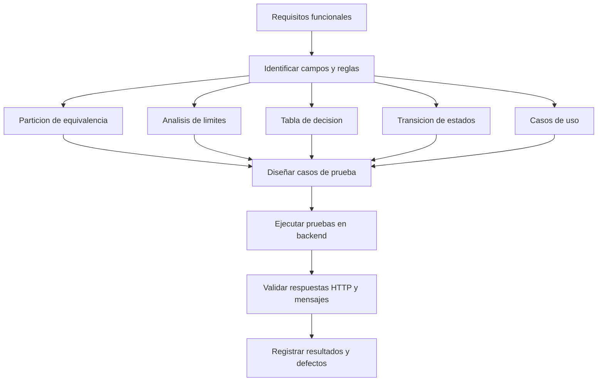

# Estrategia de Pruebas Aplicada

## Esquema breve

## Resumen corto

- Se partio de los requisitos funcionales del sistema.
- Se separaron las pruebas por modulo: Estudiantes, Materias y Matriculas.
- Se aplicaron las cuatro tecnicas pedidas:
  - Particion de equivalencia.
  - Analisis de limites.
  - Tabla de decision para matricular.
  - Transicion de estados para calificar.
- Se agregaron casos de uso para matricular estudiante y registrar nota.
- Las pruebas se implementaron como integracion contra el backend con H2 y datos semilla.
- La validacion final se hizo con `mvn test`.

## Resultado

- Suite automatizada ejecutada: 39 pruebas.
- Resultado: 0 fallos, 0 errores.
