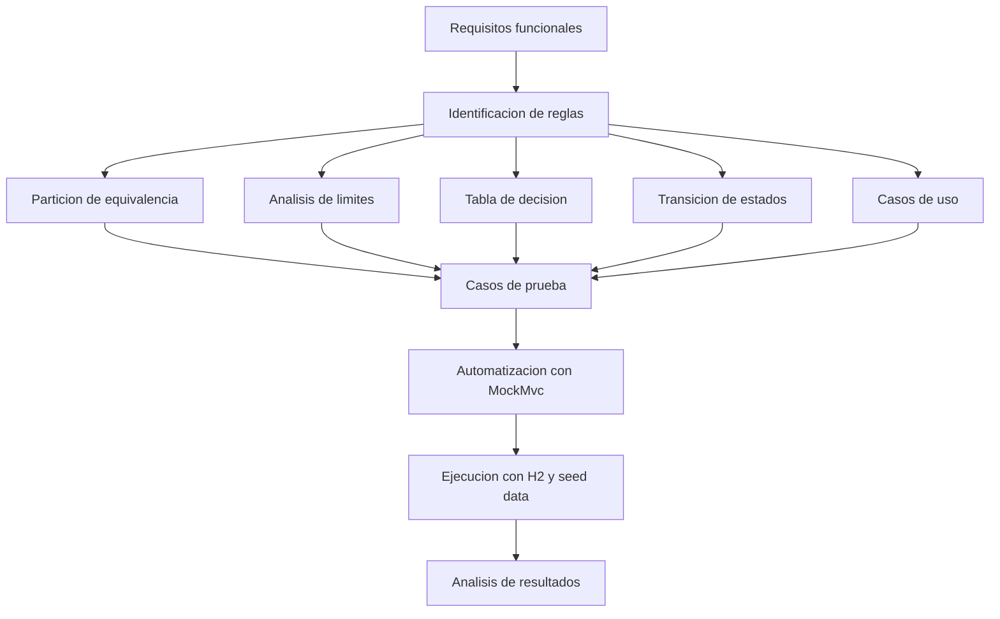

# Informe de Práctica de Caja Negra

**Nombre:** Melany Lema  
**Fecha:** 17/06/2026  
**Asignatura:** Validación y Verificación de Software

## 1. Objetivo de la práctica

Aplicar técnicas de pruebas de caja negra sobre el Sistema de Gestión Universitaria para verificar el comportamiento de sus módulos principales: Estudiantes, Materias y Matrículas. La práctica busca validar reglas de negocio, límites, transiciones de estado y flujos de uso reales a partir de los requisitos funcionales y de la implementación del backend.

## 2. Bitácora de clase

> **Nota:** este apartado se conserva sin editar, tal como fue entregado por la asignatura.

Pegar aquí la bitácora original de clase sin modificaciones.

## 3. Desarrollo refinado

### 3.1 Comprensión del sistema bajo prueba (SUT)

El sistema bajo prueba es una aplicación web de gestión universitaria compuesta por:

- Backend en Java 17 con Spring Boot.
- Frontend en HTML/CSS/JavaScript.
- Base de datos H2 en memoria.
- API REST para estudiantes, materias y matrículas.

Los módulos principales son:

- **Estudiantes:** creación, consulta, actualización y eliminación.
- **Materias:** creación, consulta, actualización y eliminación.
- **Matrículas:** matricular estudiantes, listar matrículas y registrar notas.

La semilla inicial facilita probar casos válidos e inválidos desde datos ya existentes.

### 3.2 Estrategia de prueba

La estrategia aplicada combinó las técnicas solicitadas en el enunciado:

- **Partición de equivalencia:** para separar entradas válidas e inválidas por campo.
- **Análisis de límites:** para revisar valores mínimos, máximos y cercanos a frontera.
- **Tabla de decisión:** para analizar la operación de matricular con sus cinco condiciones.
- **Transición de estados:** para validar el paso de MATRICULADO a APROBADO o REPROBADO.
- **Casos de uso:** para cubrir flujos principales, alternativos y de error.

Además, se implementaron pruebas automatizadas de integración con `MockMvc` contra el backend real, usando la base de datos H2 y los datos semilla del sistema.

### 3.3 Diagrama

### 3.4 Casos de prueba documentados

Los casos documentados en el entregable cubren lo siguiente:

- **Estudiantes:** nombre, apellido, email, fecha de nacimiento y estado.
- **Materias:** código, nombre, créditos y cupo máximo.
- **Matrículas:** existencia de estudiante y materia, estado ACTIVO, cupo disponible y no duplicidad.
- **Calificación:** transición de MATRICULADO a APROBADO o REPROBADO.

Ejemplos de cobertura aplicada:

- Valores válidos e inválidos para longitudes y formatos.
- Límites inferiores y superiores para créditos, cupo y nota.
- Casos de rechazo por reglas de negocio.
- Casos de uso con flujo principal, alternativo y error.

### 3.5 Código de prueba

Las pruebas automatizadas quedaron implementadas en el backend:

- [BaseIntegracionPruebasCajaNegra](../backend/src/test/java/com/universidad/gestion/BaseIntegracionPruebasCajaNegra.java)
- [EstudianteBlackBoxIT](../backend/src/test/java/com/universidad/gestion/EstudianteBlackBoxIT.java)
- [MateriaBlackBoxIT](../backend/src/test/java/com/universidad/gestion/MateriaBlackBoxIT.java)
- [MatriculaBlackBoxIT](../backend/src/test/java/com/universidad/gestion/MatriculaBlackBoxIT.java)

Cobertura funcional sintetizada:

- `EstudianteBlackBoxIT`: lista semilla, validaciones de nombre, apellido, email, fecha y estado.
- `MateriaBlackBoxIT`: lista semilla, validaciones de código, nombre, créditos y cupo.
- `MatriculaBlackBoxIT`: matrícula válida, estudiante/materia inexistente, estado inactivo, duplicado, cupo agotado y calificación.

## 4. Análisis de resultados y reflexión

La ejecución final de la suite automatizada fue exitosa:

- **Pruebas ejecutadas:** 39
- **Fallos:** 0
- **Errores:** 0

Resultados observados:

- La semilla inicial permitió validar directamente la lógica de negocio.
- Las reglas más críticas se confirmaron con respuestas HTTP 200, 201, 400, 404 y 422 según el caso.
- La operación de matrícula mostró validación secuencial: si falla estudiante o materia, el proceso se corta antes de revisar cupo o duplicidad.
- La calificación de matrículas respetó la transición de estados y el redondeo a dos decimales.

Reflexión:

La práctica permitió conectar los requisitos funcionales con pruebas concretas, no solo documentarlas. La parte más útil fue traducir reglas y límites en pruebas automatizadas reproducibles sobre la API real, porque eso reduce ambigüedades y deja evidencia técnica de cada decisión de prueba.
